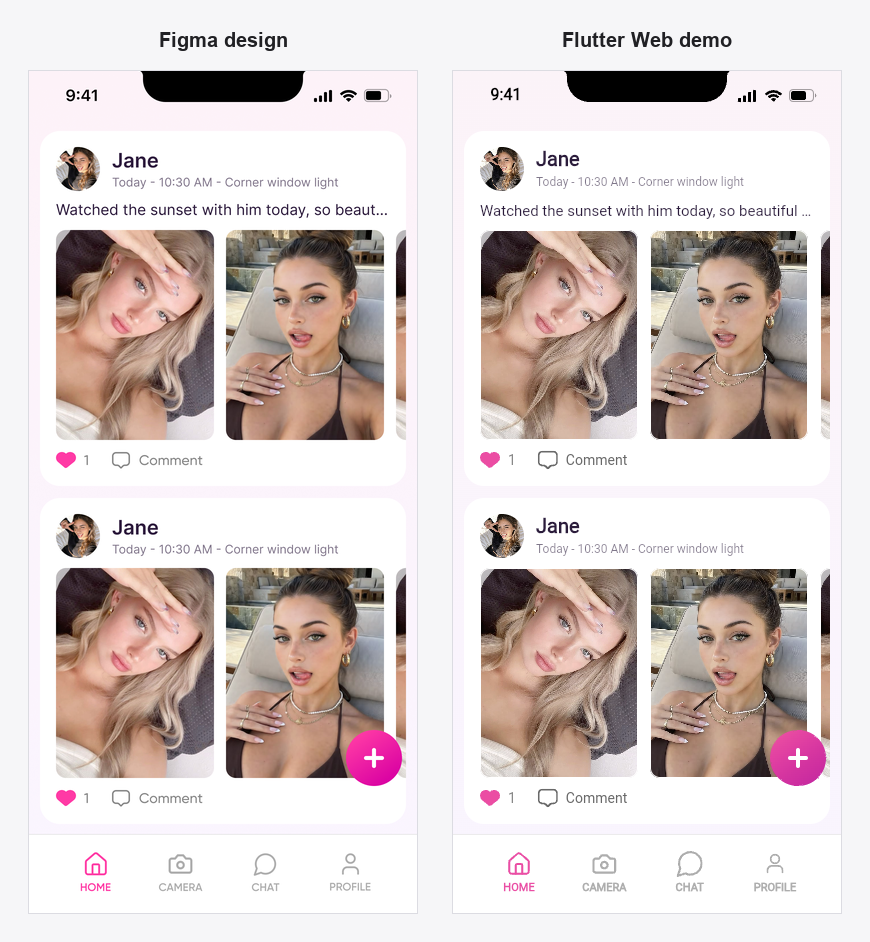
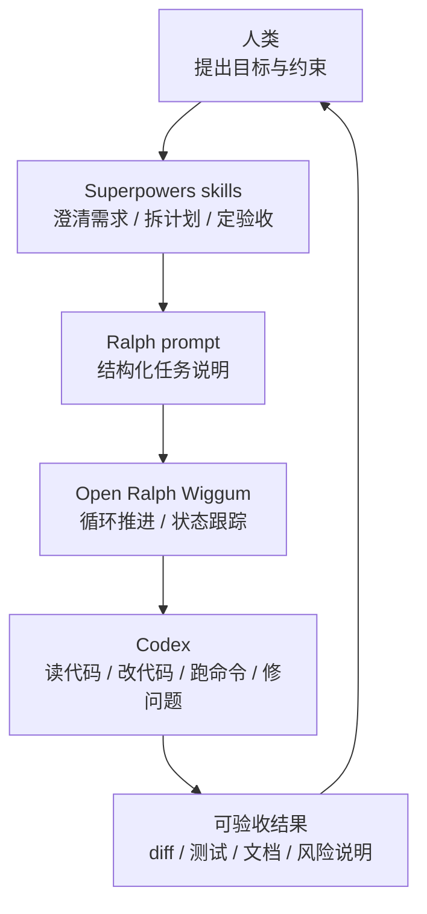
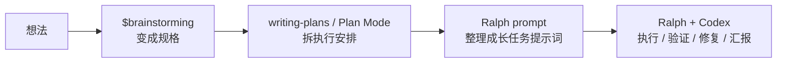
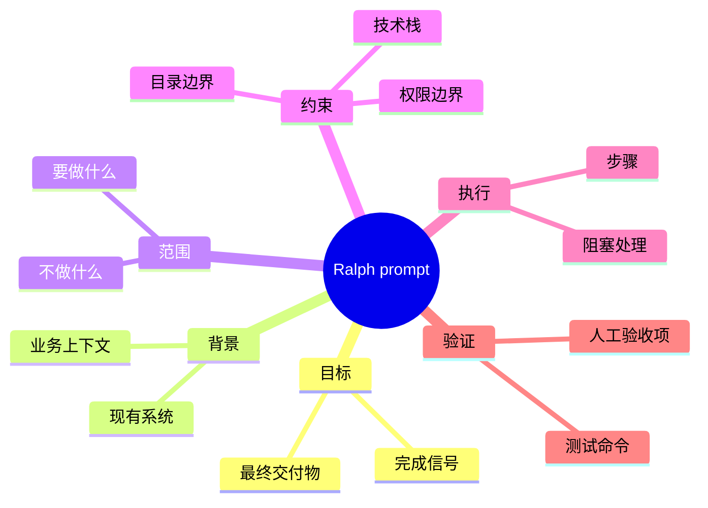
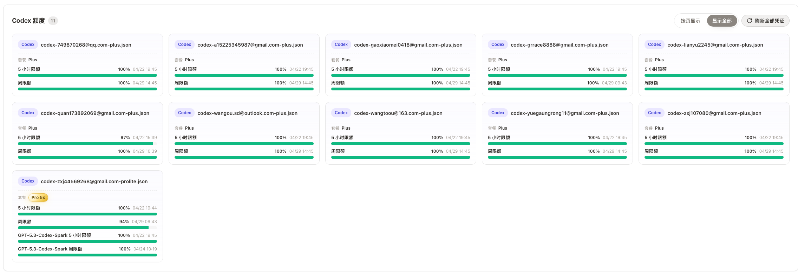

# 如何让 AI 持续推进长任务

副标题：用 Codex + Ralph，把一个需求变成“可持续推进、第二天可验收的结果”

---

## 这次分享想解决什么问题

我们现在用 AI 写代码，最常见的方式还是聊天：

- 帮我看一下这个报错
- 帮我补一个函数
- 帮我解释一下这段逻辑
- 帮我改一下这个页面

这种方式很有用，但它有一个限制：**人要一直在旁边盯着、追问、纠偏、让它继续。**

我这次想分享的是另一种用法：

> 怎么把一个需求交给 Codex，让它在无人值守的时间里持续推进，第二天给出一个可验收的结果。

一句话总结：

**不是让 AI 替你做决策，而是把原本空着的等待时间，变成一段可追踪、可回滚、可验收的执行时间。**

这件事的关键不是写一个神奇 prompt，而是把需求整理成 AI 能持续执行、我们能最终验收的工作。

---

## 先看一个真实例子

我先不讲工具，先看一个实际跑出来的例子。

这个仓库里有一个可以直接拿来讲的 demo：

- 设计稿：[figma-home-design.png](assets/figma-home-design.png)
- 任务输入：[figma-home-flutter-web-ralph-prompt.md](prompt/figma-home-flutter-web-ralph-prompt.md)
- 交付目录：[demo/](demo/)
- 核心实现：[main.dart](demo/lib/main.dart)
- 验收测试：[widget_test.dart](demo/test/widget_test.dart)
- 对比图：[figma-vs-demo-comparison.png](assets/figma-vs-demo-comparison.png)
- golden 截图：[phone_canvas.png](demo/test/goldens/phone_canvas.png)

这个示例做的事是：把一个 Figma 页面交给 AI，让它生成一个 Flutter Web demo。



如果只说：

> 帮我把这个 Figma 页面还原成 Flutter。

很容易得到一个看起来能跑、但边界很松的结果：目录可能不对，资源可能没本地化，尺寸可能跑偏，测试可能没有，最后也不知道怎么验收。

这次实际交给 Ralph/Codex 的任务更接近这样：

```text
按照 prompt/figma-home-flutter-web-ralph-prompt.md 中的要求执行。

工作目录是当前仓库根目录。
目标是完成 demo/ Flutter Web 的 Figma 像素级还原。
不要修改或提交根目录上一版 HTML 产物。
完成后运行 flutter test，并给出预览命令。
```

这次实际启动 Ralph 的命令是：

```bash
cd /path/to/ai-long-task-talk

ralph \
  --prompt-file prompt/figma-home-flutter-web-ralph-prompt.md \
  --agent codex \
  --min-iterations 2 \
  --max-iterations 5
```

这里几个参数的含义是：

- `--prompt-file`：从文件读取完整任务说明，适合这种上下文比较长、边界和验收项比较多的任务。
- `--agent codex`：让 Ralph 每一轮调用 Codex 来读代码、改代码、跑命令和总结结果。
- `--min-iterations 2`：至少执行 2 轮。即使第一轮已经输出完成信号，也会再跑一轮，让它有机会复查、补漏、验证。
- `--max-iterations 5`：最多执行 5 轮，避免任务无限循环。5 轮还没完成，就停下来让人接管判断。

这里面最重要的不是文字变长了，而是边界变清楚了：

- 输入是什么：Figma URL、file key、node id、设计尺寸
- 交付到哪里：只做 `demo/` 目录
- 技术路线是什么：Flutter Web，不是 React，也不是静态 HTML
- 不能做什么：不要覆盖根目录已有页面和资源
- 怎么验收：运行 Flutter Web、检查截图、补 widget test 和 golden 基线
- 什么时候算完成：测试通过，输出预览命令和完成说明

实际执行过程中，关键命令大概是这一组：

```bash
flutter create demo --platforms web --project-name figma_home_demo
cd demo
flutter pub get
flutter test
flutter run -d chrome --web-port 4174
```

中途为了修复和验收，还跑过这些命令：

```bash
dart format lib/main.dart test/widget_test.dart
flutter test --update-goldens
git add demo/assets/figma demo/lib/main.dart demo/test/goldens/phone_canvas.png
git commit -m "Implement Flutter Figma home demo"
```

最后的结果可以从会话记录里看到：

```text
Commit: f5b4632 Implement Flutter Figma home demo
Test: 00:00 +2: All tests passed!
Preview: http://localhost:4174/
Goal time: 643 seconds
```

最终交付物不是一段代码片段，而是一个完整目录：

```text
demo/
  pubspec.yaml
  lib/main.dart
  assets/figma/
  test/widget_test.dart
  test/goldens/phone_canvas.png
  web/
```

第二天验收时，不是只看它说“完成了”，而是可以实际检查：

```bash
cd demo
flutter pub get
flutter test
flutter run -d chrome --web-port 4174
```

验收重点：

- 画布尺寸是否正确
- 图片和 SVG 是否本地化
- 是否没有依赖 Figma 临时 URL
- widget test 和 golden 基线是否能跑
- 浏览器里是否能看到完整 demo

这个例子想说明一件事：**长任务不是让 AI 自由发挥，而是给它一条足够清楚的执行轨道。**

---

## 真正的变化是什么

重点不是模型突然会魔法了，而是任务开始能连续推进了。

以前更像问答：

- 我问一个问题
- AI 回答一次
- 我看结果
- 我再追问

现在更像交办工作：

- 人定义目标和边界
- 工具持续推进
- 过程可以观察
- 结果可以验收
- 不合格可以回滚

**不是问它“这个怎么做”，而是交给它“把这件事做到可验收”。**

这背后的心态变化很重要：我们没有把判断权交出去，而是把执行时长交出去。

---

## 工具怎么分工

我现在常用的是三层：

- `Superpowers skills` 负责把需求整理成可执行任务
- `Open Ralph Wiggum` 负责循环推进
- `Codex` 负责看代码、改代码、跑命令、修问题、总结结果

可以简单理解成：



这三个东西不是互相替代，而是分工不同：

- Superpowers 解决“到底该执行什么”
- Ralph 解决“怎么持续执行下去”
- Codex 解决“具体怎么在代码仓库里完成”

Ralph 不是替代 Codex，而是给 Codex 加一个持续执行循环。它会一轮一轮地把任务继续推下去，让 agent 不停留在“我已经分析完了”的状态，而是继续执行、验证、修复、汇报。

---

## Superpowers：把想法变成可执行任务

在讲 Ralph 之前，我想先讲一个更前置的东西：Superpowers skills。

我现在不是直接把一句需求丢给 AI，而是先用 skills 把需求整理成更清楚的任务。这样 Ralph 后面拿到的不是一句“帮我做一下”，而是一份能执行、能验证的任务说明。

我常用的 skills 大概是这些：

| Skill | 我一般什么时候用 |
| --- | --- |
| `$brainstorming` | 需求还不清楚时，用它先问问题、比较方案、收敛范围。 |
| `writing-plans` | 需求已经明确后，用它拆执行步骤，适合生成 Ralph 的长任务计划。 |
| `test-driven-development` | 做功能或修 bug 前，先定义测试和验收，避免只凭感觉改。 |
| `systematic-debugging` | 遇到 bug 时，先复现、定位、验证假设，再修复。 |
| `frontend-design` | 做页面、组件、交互时，用它补设计质量、状态、响应式和视觉细节。 |
| `requesting-code-review` | 完成大改后，让另一个视角检查风险、遗漏和测试缺口。 |
| `finishing-a-development-branch` | 任务做完后，整理分支、PR、合并和收尾动作。 |

这张表想表达的不是“我有很多工具”，而是：不同阶段的问题，要用不同的 skill 处理。

我的常用顺序是：



### `$brainstorming` 和 Plan Mode 的差异

`$brainstorming` 和 Plan Mode 都是在“动手之前先想清楚”，但它们不是一回事。

| 对比项 | `$brainstorming` | Plan Mode |
| --- | --- | --- |
| 本质 | 一个 Superpowers skill | 一个交互/工作模式 |
| 主要用途 | 把模糊想法变成设计和规格 | 在执行前先列计划、评估步骤 |
| 适合阶段 | 需求还没完全清楚，需要问问题、比较方案、收敛范围 | 目标已经比较明确，需要安排执行顺序 |
| 输出 | 设计说明、边界、验收标准，通常会沉淀成 spec | 当前任务的执行计划 |
| 强约束 | 先探索上下文、提问、给方案、用户确认后再实现 | 主要约束是先计划，不急着改 |
| 和 Ralph 的关系 | 用来生成高质量 Ralph prompt | 用来检查这个 prompt 怎么执行 |

简单说：`$brainstorming` 负责把“想法”变成“规格”，Plan Mode 负责把“规格”变成“执行安排”，Ralph 负责把“执行安排”持续推下去。

---

## 一个适合 Ralph 的 prompt 应该有什么

如果说 Ralph 解决的是“怎么持续执行”，那 Superpowers 解决的是“到底该执行什么”。它的价值不是让 prompt 变长，而是让 prompt 变得有结构。

一个适合交给 Ralph 的提示词，通常应该包含：

- 目标：最后要交付什么
- 背景：为什么做、现有系统是什么样
- 范围：要做什么，也要写清楚不做什么
- 约束：技术栈、目录、依赖、兼容性、权限边界
- 步骤：先做什么，再做什么，遇到阻塞怎么处理
- 验证：跑哪些命令，怎么看结果
- 完成信号：什么情况下可以输出 `COMPLETE`



可以把一个模糊需求这样改：

不要说：

```text
帮我优化一下导出功能。
```

更好的写法：

```text
在现有后台增加导出报表能力，支持按时间筛选，复用已有分页和权限逻辑，补齐测试，更新文档，不能影响现有分页接口。

完成后运行测试并输出变更摘要，所有验收项通过时输出 <promise>COMPLETE</promise>。
```

好的长任务需求至少要说清楚：

- 要做什么
- 不做什么
- 涉及哪些模块
- 哪些接口不能破坏
- 怎么验证
- 完成时怎么汇报

---

## Ralph 怎么用

GitHub：

- [open-ralph-wiggum](https://github.com/Th0rgal/open-ralph-wiggum)

直接跑一个任务：

```bash
ralph "为现有后台增加一个导出报表功能，支持按时间筛选，复用已有权限逻辑，补齐测试并更新文档。完成时输出 <promise>COMPLETE</promise>。" \
  --agent codex \
  --model gpt-5.5 \
  --max-iterations 10
```

复杂一点的任务可以开 `tasks mode`：

```bash
ralph "实现导出报表需求，先拆成子任务，再逐步完成。每轮都要说明进度、阻塞和下一步。所有测试通过后输出 <promise>COMPLETE</promise>。" \
  --agent codex \
  --model gpt-5.5 \
  --tasks \
  --max-iterations 20
```

看状态：

```bash
ralph --status
```

补上下文：

```bash
ralph --add-context "不要修改现有分页接口，优先复用 utils/csv.ts。"
```

这里最大的变化不是命令，而是心态：不是在问它怎么做，而是在让它把事情做完。

---

## 启动前要准备什么

面向技术同事，真正能不能跑起来，主要看准备工作。

### 1. 仓库状态

建议在独立分支或 worktree 里跑：

- 当前分支干净，或者明确哪些改动是已有改动
- 不要直接在生产发布分支上跑长任务
- 任务开始前记录基线 commit
- 最好提前准备好回滚方式

### 2. 权限边界

默认给最小权限：

- 可以读写仓库代码
- 可以安装依赖，但最好限制在项目范围内
- 可以跑测试、lint、build
- 不给生产数据库、生产密钥、线上发布权限

如果任务需要访问外部服务，把 token 和环境变量写清楚，但不要给它不必要的权限。

### 3. 运行方式

至少提前告诉它：

- 如何安装依赖
- 如何启动项目
- 如何跑单测
- 如何跑 lint
- 如何跑类型检查
- 哪些命令耗时长
- 哪些测试已知不稳定

不要只说“补齐测试”，最好直接给命令：

```bash
npm test
npm run lint
npm run typecheck
```

或者：

```bash
pnpm test
pnpm lint
pnpm build
```

### 4. 完成标准

长任务一定要有明确的结束条件。

比如：

- 功能实现完成
- 单测通过
- lint 通过
- 文档更新
- 输出变更摘要
- 输出未完成项
- 最后打印 `<promise>COMPLETE</promise>`

完成标准越清楚，第二天越容易验收。

---

## 先说现实：它不是免费自动机器

### 1. 这件事比较烧 token

长时间读代码、改代码、跑命令、修测试、反复迭代，本质上是在持续消耗上下文、推理额度和模型调用次数。

所以不要把它理解成“完全不用管的自动产出机器”，更准确地说：

**这是在用 token 和算力，换连续执行时间。**

适合处理那些有明确边界、能自动验证、人工第二天可以验收的任务；不适合拿来做模糊探索、拍脑袋设计，或者高风险生产操作。

### 2. 链路要稳

长任务最怕的不是模型不聪明，而是中途断掉。

常见问题包括：

- CLI 会话中断
- 模型额度或订阅窗口限制
- 网络抖动
- 认证失效
- 任务跑到一半无人接管

我的做法是接一层自建中转，把 CLI 请求统一走代理。

这样做的价值不是“让模型更聪明”，而是让执行链路更工程化：

- 长任务更稳
- 鉴权、账号、转发统一管理
- 更容易观察请求状态
- 出问题时更容易定位是模型、网络、代理还是本地命令

开源方案可以参考：

- [CLIProxyAPI](https://github.com/router-for-me/CLIProxyAPI)
- [Sub2API](https://github.com/Wei-Shaw/sub2api)
- [New API](https://github.com/QuantumNous/new-api)

**想让 AI 做长任务，前提不是 prompt 写得多花，而是执行链路要稳。**



---

## 什么任务适合长任务执行

适合：

- 目标明确
- 边界清楚
- 有现成上下文
- 可以自动验证
- 第二天可以人工验收

典型场景：

- 小功能开发
- 补测试
- 补文档
- 修复明确可复现的问题
- 有验收标准的重构
- 批量迁移一类重复代码
- 根据 PRD 或 tasks list 完成边界明确的迭代

判断标准很简单：

**如果你能在任务开始前写清楚“做到什么算完成”，它就有机会交给 AI 持续推进。**

---

## 不适合使用 Ralph Loop 的场景

- 需求一天三变，还在反复讨论
- 跨团队协作很多，推进主要靠沟通而不是编码
- 高风险权限、资金、生产变更、合规链路
- 没有明确完成标准，做完与否说不清
- 需要大量人工判断的设计类问题
- 一次性操作，不需要反复迭代
- 生产环境在线排障，要求精准判断和即时止损
- 安全边界不清楚，无法限制它能访问什么

这些场景不是 AI 不能参与，而是不适合放进“无人值守的持续执行循环”里。

---

## 持续执行，不等于放弃控制

至少守住四件事：

1. 权限最小化
2. 过程可追踪
3. 结果可回滚
4. 人类最终验收

再补几条工程习惯：

- 用独立分支或 worktree 跑
- 不自动上线
- 不给生产密钥
- 大任务先拆小
- 先跑低风险任务
- 第二天必须 review diff
- 失败也要让它输出失败原因和当前状态

最成熟的姿势不是把决策权交给 AI，而是把执行时长交给 AI。

---

## 第二天怎么验收

建议按这个顺序看：

1. 先看最终汇报
2. 再看代码 diff
3. 最后自己重新跑关键命令

不要只相信它的总结。

最终汇报重点看：

- 完成了什么
- 哪些命令跑过
- 哪些命令失败
- 有没有剩余风险
- 有没有人工验收项

代码 diff 重点看：

- 是否只改了相关文件
- 有没有无关重构
- 有没有临时调试代码
- 有没有泄露密钥、日志、大文件
- 有没有绕过测试或降低校验

关键命令按项目替换，比如：

```bash
npm test
npm run lint
npm run typecheck
```

如果是前端功能，自己点一遍核心流程；如果是后端接口，就用测试、curl、Postman 或现有 API 工具验一下关键路径。

---

## 可以直接复制的长任务交办模板

下面这个模板可以发给 Codex/Ralph，按项目改一下就能用。

```text
目标：
请在当前仓库完成【这里写具体任务】。

背景：
- 技术栈：【React / Next.js / Node / Rails / Python 等】
- 相关模块：【写路径，例如 apps/admin/src/features/export】
- 相关文档：【写路径或链接】
- 现有限制：【写不能破坏的接口、数据结构、兼容性要求】

实现要求：
- 【要求 1】
- 【要求 2】
- 【要求 3】

不要做：
- 不要修改生产配置
- 不要引入大型新依赖，除非先说明原因
- 不要重构无关模块
- 不要自动发布或操作生产环境

验证方式：
- 安装依赖：【命令】
- 运行测试：【命令】
- lint/typecheck/build：【命令】

完成标准：
- 功能按要求实现
- 测试通过，或明确说明失败原因
- 更新必要文档
- 输出变更摘要
- 输出剩余风险或人工验收项
- 全部完成时输出 <promise>COMPLETE</promise>
```

这个模板的目的不是把 prompt 写长，而是减少 AI 猜测。

---

## 如果明天就想试

建议从这三类任务开始：

1. 给现有页面加一个小功能并补测试
2. 修一组明确可复现的报错
3. 按 PRD 或 tasks list 完成一个边界明确的迭代

第一轮不要追求全自动上线，只看两件事：

- 它能不能持续推进
- 它第二天能不能交回来一个像样的结果

团队里可以先沉淀三样东西：

- 一份长任务交办模板
- 一份项目验证命令清单
- 一份第二天验收 checklist

当这三样东西稳定下来，AI 长任务执行就会从“偶尔试一下”，变成一种可复用的工程实践。

---

## 最后一句

未来真正拉开差距的，可能不是谁更会写 prompt，而是谁更会把需求定义成一份 AI 能持续执行的工作。

**不是让 AI 取代你，而是让它在你不用一直盯着的时候，继续把工作往前推。**

---

## 参考

- [open-ralph-wiggum](https://github.com/Th0rgal/open-ralph-wiggum)
- [Quick Start](https://github.com/Th0rgal/open-ralph-wiggum#quick-start)
